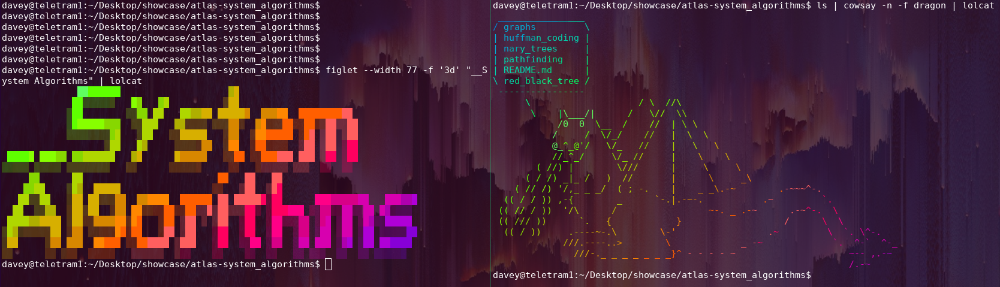

# System Algorithms

## Linkedin

https://www.linkedin.com/in/daveyhaysiii/

## Description

This repo contains all our systems algorithms projects as part of ATLAS school's LAB program. Our goal was to learn how to use advanced data structures to efficiently perform complex computing tasks and leverage the efficiency and utility of these structures in a practical way.

## Table of Contents

| Module           | Description                                         |
| ---------------- | --------------------------------------------------- |
| red-black trees  | efficient form of self balancing binary search tree |
| huffmans         | data compression structure and algorithm            |
| graphs           | traversing the graph data structure                 |
| pathfinding      | pathfinding algorithms (dijkstras, A\*)             |
| n-ary trees      | traversing nary trees                               |

## How to read these projects

Each project has its own README.md containing the project data as provided by ATLAS, including the relevant data structure definitions, how to compile, and sample files to test output against.

## Todos

- Actually write out the READMEs for the sub projects
